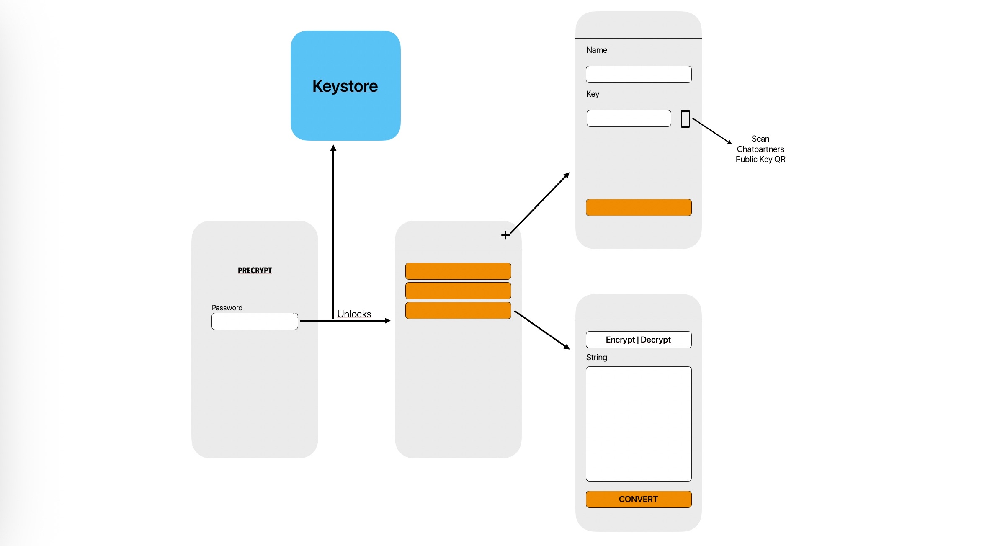

# Decrypt

Eine kleine Flutter‑App zum Verwalten von Kontakten und Schlüsseln (Public/Private), Erzeugen und Anzeigen von QR‑Codes sowie Verschlüsselungsfunktionen über einen internen Keystore.

## Voraussetzungen
- Flutter SDK (>= 3.9) (Empfohlen)
- Android SDK
- Geräteberechtigungen für Kamera (wenn QR‑Scanner benutzt werden will)

## Schnellstart
1. Abhängigkeiten installieren:
   ```
   flutter pub get
   ```
2. Auf einem verbundenen Gerät starten:
   ```
   flutter run -d (device_id)
   ```
3. Release‑APK (Android) bauen:
   ```
   flutter build apk --release
   ```

## Projektstruktur (wichtigste Dateien)
- lib/main.dart — App‑Start; initialisiert KeyStoreService und setzt die Routen.
- lib/screens/
  - login_page.dart — Registrierung / Login (Passwortverwaltung).
  - home_page.dart — Hauptansicht: eigener Public Key, Kontakte, Aktionen.
  - qr_scanner_page.dart — QR‑Scanner (falls vorhanden).
  - qr_dialog.dart — QR‑Dialog zur Anzeige / Teilen / Kopieren.
- lib/services/
  - keystore_service.dart — zentrale Logik zum Speichern/Verschlüsseln des Keystores.
  - cryptography.dart — kryptografische Hilfsfunktionen (Key‑Erzeugung, Verschlüsselung/Entschlüsselung).


## Wichtige Hinweise
- Keystore: KeyStoreService speichert einen Master‑Key im Secure Storage und verschlüsselt einen Blob in SharedPreferences. Beim Sperren (lock) werden Schlüssel aus dem Arbeitsspeicher entfernt, beim Entsperren (unlock) neu geladen.

## Erste Projektskizze


## Entwicklung
- Für UI‑Änderungen sind die vorhanden Widgets in lib/screens vorgesehen

## Verwendete Technologien
- Framework: Flutter
- Programmiersprache: Dart
 #### Pakete / Libraries
- shared_preferences — lokale Key/Value‑Speicherung
- flutter_secure_storage — sicheres Speichern von Master‑Keys
- encrypt — AES‑Verschlüsselung (Blob‑Verschlüsselung)
- cryptography — kryptografische Hilfsfunktionen / Key‑Erzeugung
- qr_flutter — QR‑Code Erzeugung / Anzeige
- mobile_scanner / qr_code_scanner — QR‑Scanner
- share_plus — Teilen von Text / Daten
- cupertino_icons — Icons

## Verschlüsselung

- Die App verwendet ein hybrides Verschlüsselungsverfahren basierend auf Elliptic Curve Diffie-Hellman (X25519) und AES:
- Jeder Nutzer besitzt ein statisches Public/Private Keypair.
- Für jede Nachricht wird zusätzlich ein flüchtiges (ephemeres) Keypair erzeugt.
- Der ephemere private Key wird mit dem statischen Public Key des Empfängers kombiniert, um ein Shared Secret zu berechnen.
- Dieses Shared Secret dient als Schlüssel für die symmetrische AES-Verschlüsselung des Nachrichtentextes.
- Die Nachricht enthält den ephemeren Public Key, damit der Empfänger denselben Shared Secret und damit den AES-Key rekonstruieren kann.

Mehr Infos zum verwendeten Verfahren: curves.xargs.org

## Mögliche Erweiterungen
- Chat-Verläufe speichern
- Push-Benachrichtigungen
- Synchronisation von Kontakten über Cloud
- Biometrische Entsperrung des

## Autoren
- Hans Kuntsche, Paul Weibbrecht
- Projekt im Rahmen des Moduls Web- und App-Programmierung (3MI-WAP-50)
- Duale Hochschule Sachsen, 2025

## Quellen
- Hintergrundbild Login: https://pixabay.com/illustrations/cyber-security-technology-network-3374252/


## Lizenz
Privates Projekt — nicht für Veröffentlichung vorgesehen
